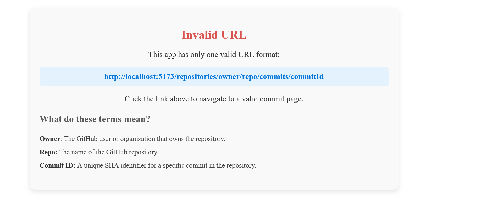

# 📝 Git Commit Viewer

🚀 A lightweight full-stack web application to fetch and display commit details and diff from GitHub repositories. Built using **Node.js (backend)** and **React (frontend)** with **Tailwind CSS** for styling.

## 📌 Features

- View commit details including author, date, and commit message.
- See file changes with line-level diff and change statistics.
- Redirects invalid URLs to an informative page.
- Easy setup with a single command to install dependencies and start the project.

## Screenshots

### 🖥️ Main Page

The main interface of the app:  


### 🖼️ Info Page

If an invalid URL is entered, the user is redirected to the Info Page:  


## 🛠️ Tech Stack

- **Backend:** Node.js (Express.js)
- **Frontend:** React (Vite)
- **Styling:** CSS
- **API Source:** GitHub REST API

## 🚀 Setup & Installation

1. Clone the repository:

   ```bash
   git clone https://github.com/your-repo.git
   cd your-repo
   ```

2. Install dependencies and start the project with a single command:

   ```bash
   node setup.js
   ```

   > This script will install dependencies for both frontend & backend and start the servers.

3. By default, the backend runs on **PORT 8001**. If needed, change it in `backend/.env`.

## 🌍 API Endpoints

### ✅ Get Commit Info

```http
GET /repositories/{owner}/{repo}/commits/{oid}
```

#### 📥 Response:

```json
{
  "success": true,
  "data": {
    "oid": "559ceb5556002a44327455fef6ae896522000ef2",
    "subject": "make-port-env-version-fixed",
    "message": null,
    "author": {
      "name": "code826",
      "date": "2024-10-19T15:07:28Z",
      "email": "code.for.fun.1997@gmail.com",
      "avatar_url": "https://avatars.githubusercontent.com/u/174486210?v=4"
    },
    "committer": {
      "name": "code826",
      "date": "2024-10-19T15:07:28Z",
      "email": "code.for.fun.1997@gmail.com",
      "avatar_url": "https://avatars.githubusercontent.com/u/174486210?v=4"
    },
    "parents": [
      {
        "oid": "7599c4f353e6b1b3bb19287eb39f65de58c5cef9"
      }
    ]
  }
}
```

### 🔍 Get Commit Diff

```http
GET /repositories/{owner}/{repo}/commits/{oid}/diff
```

#### 📥 Response:

```json
{
    "success": true,
    {
        "changeKind": "MODIFIED",
        "headFile": {
            "path": "index.js",
            "sha": "e022d6690b23515c64d15bf0608076e289d46c7b"
        },
        "baseFile": {
            "path": "index.js",
            "sha": "index.js"
        },
        "stats": {
            "additions": 4,
            "deletions": 5,
            "totalChanges": 9
        },
        "hunks": [
            {
                "header": "@@ -7,7 +7,7 @@ import uploadFile from './src/middleware/uploadFile.js';",
                "baseStartLine": 7,
                "baseLineCount": 7,
                "headStartLine": 7,
                "headLineCount": 7,
                "lines": [
                    {
                        "content": "import session from 'express-session';",
                        "type": "UNCHANGED",
                        "baseLineNumber": 7,
                        "headLineNumber": 7
                    }
                ]
            }
        ]
    }
}
```

## 📌 Project Structure

```
📦 project-root
 ┣ 📂 backend  # Node.js (Express) server
 ┃ ┣ 📜 index.js
 ┃ ┣ 📜 utils.js
 ┃ ┣ 📜 ApplicationError.js
 ┃ ┣ 📜 .env
 ┣ 📂 frontend  # React app
 ┃ ┣ 📂 src/component
 ┃ ┃ ┣ 📜 App.jsx
 ┃ ┃ ┣ 📜 CommitPage.jsx
 ┃ ┃ ┣ 📜 InfoPage.jsx
 ┃ ┣ 📜 package.json
 ┣ 📜 package.json (root)
 ┣ 📜 README.md
 ┗ 📜 .gitignore
```

## 🎨 UI Enhancements & Future Improvements

- 📱 **Responsive UI**: Improve UI to be fully mobile-friendly.
- 🔍 **Search Feature**: Allow searching repositories by username.
- 📊 **Compare Commits**: Add an option to compare different commit IDs.
- ⭐ **Suggested Repositories**: Display high-rated repositories for quick access.

📢 **Contributions & Feedback Welcome!** 🚀
